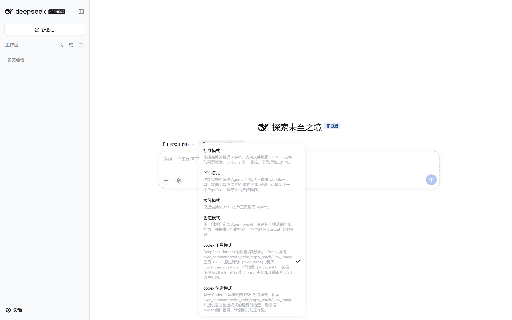
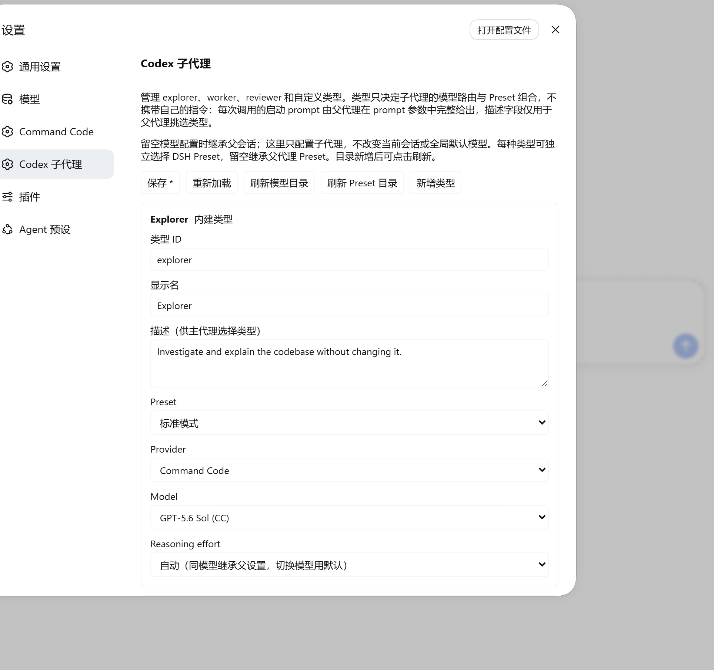

# dsh-codex-mode

轻量的 DeepSeek Harness 编码预设。它借用 Codex 常用的工具名称和编辑工作流，但不复刻 Codex 的运行时上下文、审批策略或压缩器。

面向 GPT 系模型设计：自带 OpenAI Chat Completions 与 Responses API 两条路由，
`codex 工具模式` / `codex 创造模式` 两个预设可直接选中使用。



## 提供内容

- `exec_command` / `write_stdin`：DSH shell 适配器，保留长命令轮询和输出截断体验。
- `apply_patch`：自由格式补丁编辑器；这是首选文件编辑工具。
- `win32-atomic-write-fallback`：Windows host 行。ReFS / 无 WRITE_DAC 的 ACL 上，官方原子写的 `SetFileSecurityW` 会 EACCES；此行回退到 `rename`，`apply_patch` / `write` / `edit` 才能落盘。
- `view_image`：本地图片查看。
- DSH 原生工具：计划 `todo_write`、提问 `ask_user_question`、子代理 `subagent` / `subagent_fork`（+ `send_message` / `interrupt_agent` / `list_agents`）、`web_search`。
- OpenAI Chat Completions 和 Responses API 路由。
- `codex 工具模式` 预设：简短编码提示，`AGENTS.md` 指令加载，以及上述工具行。
- `codex 创造模式` 预设：同一套 Codex 工具面，再叠官方创造模式（`cordis`）能力：`tool-cordis`、composition/plugin 技能、计划模式、目标、工作流与 ralph。

DSH 自己继续处理工作目录、运行时上下文、沙箱、审批、压缩和宿主工具。预设只
替换工具面（codex 形状的终端与补丁工具），计划/提问/子代理等协作工具一律使用
DSH 原生实现；不会注入 Codex 格式的 `<environment_context>` 或
`<current_time_reminder>`。`codex 创造模式` 会再挂一份 `tool-cordis`；host
行 `share-cordis-inspect` 让它与官方创造模式共用全局 inspect provider，避免
`Service is already registered`。

## 安装

```sh
dsh plugin --profile web add file:D:/Data/DEV/dsh/dsh-codex-mode
# 或发布后：
# dsh plugin --profile web add dsh-codex-mode
```

## 图形化子代理类型（0.2.0）

安装后重启现有 DSH Web 并刷新原页面，在**设置 → Codex 子代理**管理类型：

- `explorer`：调查代码、定位实现和依赖。
- `worker`：执行范围明确的实现任务并验证。
- `reviewer`：独立检查缺陷、回归和测试遗漏。
- 自定义类型：添加稳定的类型 ID、显示名和任务描述。内建类型可编辑，自定义类型可删除。

每个类型默认继承父会话模型，也可选择独立 provider、model、reasoning effort。
下拉目录来自 DSH 原生 LLM 服务，包含所有已注册提供商的广告模型；推理强度来自模型元数据，不硬编码。
这里保存的是子代理配置，不会调用会话的模型切换接口，不会修改主会话/全局默认模型，也不复制 API key。
模型目录加载失败时可刷新重试；保存采用 DSH settings 原生版本校验，避免多个页面相互覆盖。



**类型不携带指令（0.3.0）**：类型只是「委派配置」，决定子代理的 LLM 路由和 Preset 组合，
其 `description` 是父代理挑选类型时能看到的唯一文本。每个子代理的启动 prompt
完全由父代理在该次调用的 `prompt` 参数中给出——因此这次委派的 prompt 必须是自足的：
写清目标、相关上下文，以及子代理必须遵守的每一条约束（包括是否允许修改文件）。
类型名本身不含任何隐含行为。

上一版（0.2.x）的 `instructions` 字段已移除：它曾作为原生 `persona` 注入子代理的
system prompt 段落（`deployment:persona-prefix`），并会覆盖所选 preset 自己的人设。
旧持久化配置中的该字段仍可读取，但会在读取与写入时被丢弃，下次保存即清理干净，
不会导致启动校验失败。

**独立 Preset（0.2.1）**：每种类型还可以选择自己的 DSH agent preset，实际挂载该预设的工具、
插件与技能组合，不只是换模型。下拉目录来自 DSH 原生预设发现，新增预设后点击刷新即可选择。
留空表示继承父会话原有 preset，兼容 0.2.0 配置；模型选择与 preset 选择互相独立。
损坏或已删除的 preset 会明确报错，不会静默退回父预设。这里不会更改主会话或全局默认 preset。
原生委派的审批策略和显式沙箱覆盖继续保留。
Preset 是可执行插件组合，应只选择可信预设；切换后不再保留父 preset 独有的工具限制或插件守卫，
自定义 preset 不应覆盖宿主的沙箱/审批服务。
`subagent` / `subagent_fork` 都支持，已创建子代理持久保存实际选中的 preset，
后续修改类型配置不会改变该子代理恢复时的选择。Fork 继承的历史不代表保留父 preset 的当前工具集。
执行适配依赖原生子代理的同步 setup/发布 commit 合约；异步预设加载只发生在临时 scope，
取消后不会继续修改 child。升级 DSH 时必须重跑 `npm run test:agents`，不应跳过该兼容性检查。

两个 Codex 预设强制使用类型化调用（缺失或未知类型会被执行端拒绝）：

```json
{"agent_type":"explorer","description":"定位认证流程","prompt":"调查登录入口与凭据校验位置。只读取文件并报告结论，不要修改任何文件。"}
```

该参数可用于 `subagent` 或 `subagent_fork`。调度、后台通知、深度限制、取消以及
`send_message` / `list_agents` 仍由 DSH 原生实现负责。
类型不授予沙箱权限：「不要修改文件」这类约束写在 `prompt` 里只是行为指导，
不是文件系统访问控制；真正的限制来自所选 preset 的工具组合与委派时固定的权限范围。

保存新增/修改类型后，已挂载本扩展的会话在**下一次模型请求组装**时更新 `agent_type` 枚举和选择指导，
不需要新建会话、刷新页面或重启。新增类型仍使用上述两个稳定工具入口，而不是为每个类型注册新函数。
已运行的子代理保持启动时的配置；正在生成的模型请求不会被中途改写。
首次从旧版本升级需要重启现有宿主并重新挂载更新后的 Codex 预设，不能热修改旧 Agent 的组成。

测试：`npm test`（现有回归及类型配置、原生委派适配和设置页），`npm run test:e2e`
（真实 Chromium / React DOM + 原始客户端文件 + 真实 Cordis SettingsProvider，覆盖增改删、模型强度选择、保存冲突）。
E2E 只模拟模型目录；HTTP 通过 Playwright 路由桥接 Host handler，不启动替代服务器，也不消耗真实模型额度。
它不代替已登录生产 GUI 的集成验证。

**安装路径回归（0.3.2）**：`scripts/bundle-patch.smoke.js` 专门守
`dsh plugin --profile <name> add dsh-codex-mode` 这条市场安装路径。它按
`npm pack --dry-run --json` **复制出真实的已发布布局**，再在其中解析本包
`cordis.patch.yml` 的每一行，断言同一个包最多只有一行带客户端、且本包恰好带一次。

为什么必须复制发布布局、不能在仓库工作树里查：仓库带有 `plugins/package.json`
（private，name `dsh-codex`，**不在发布白名单里**），它会截断 client-modules 的
包根回溯，让路径式行解析到一个没有 `dsh.client` 的包——于是在仓库里检查会得出
「干净」的结论，而同样的 bundle patch 装在真实 profile 里会直接启动失败。

背景：0.3.0 的 bundle patch 用路径式写法（`./plugins/x.js`）挂了 7 行，每行都解析到
本包，于是同一个包名注册出 7 个 client source，`client-modules` 拒绝组装，市场默认
安装命令产出**起不来的 profile**。该缺陷在 0.3.1 修复；本测试确保它不会复发，
同时也守住 "新增插件行却忘了加进 `files`/`exports`" 这类只在安装后才暴露的问题，
以及 README 里引用的截图必须随包发布（否则 registry 页面显示裂图）。

开发依赖可在干净 clone 安装，并用 `npx playwright install chromium` 安装测试浏览器。
本机临时 `node_modules` 是指向 DSH 依赖的 junction，**不要在该 junction 上运行 npm install**；
可在独立测试目录安装 Playwright 1.60.0、React/ReactDOM 18.3.1，设置 `DSH_E2E_DEPS` 为其 node_modules 路径。
`DSH_E2E_CHROMIUM` 可指定已有 Chrome 可执行文件；`DSH_E2E_SCREENSHOT` 可指定截图路径。

重启 DSH 后，host 行 `codex-preset-publisher` 会把包内
`agent-presets/codex` 和 `agent-presets/codex-creative` **自动复制**到
`$DSH_HOME/.agent-presets/`（真实目录，不是 junction）。新会话可选择
**codex 工具模式** 或 **codex 创造模式**。`openai-responses` 路由可将
`apply_patch` 作为自由格式 custom tool；Chat Completions 路由则将它作为
普通函数调用。

离线/开发备用：`scripts/install.ps1` 仍可手工复制同一份预设，并保留
`$DSH_HOME/plugins` junction。日常用户不需要跑它。

> **预设发现**：`dsh-agent-presets` 的 `scanRoot` 跳过 junction / 符号链接。
> 发布器因此始终写成真实目录。工具行通过 `dsh-codex-mode/plugins/tools/...`
> 包导出解析，拷贝后的预设不依赖仓库相对路径。`replay-codex` 只是
> alignment 冻结副本，不是日常编码预设。详细排查见 `plugins/ACTIVATION.md` §5。

## 验证

```bash
npm test
```

测试覆盖预设模块可加载性、preset 自动发布、保留工具的行为，以及两个 OpenAI 路由。历史上的完整 Codex 对齐研究保留在 `docs/`，不再是该插件的运行时契约。
